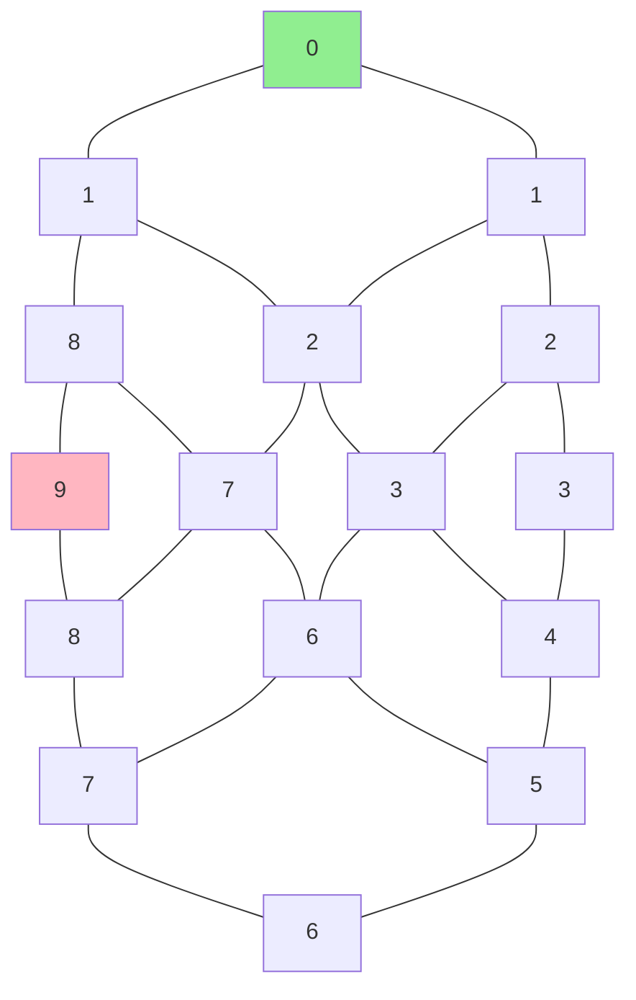

# 🏃 Hiking Trails Pathfinding Solution 🗺️

## 🎯 Problem Description

This program solves a pathfinding challenge in a mountain hiking system. Find all possible paths from trailheads to peaks! 🏔️

### 📊 Grid Example

🟢 Green: Trailhead (elevation 0)
🔴 Red: Peak (elevation 9)

### 🎮 Game Rules
- Start at any trailhead (elevation 0️⃣)
- Climb your way to peaks (elevation 9️⃣)
- Can only move ⬆️ ⬇️ ⬅️ ➡️ (up, down, left, right)
- Each step must increase elevation by exactly 1️⃣
- No backtracking on the same path! 🚫

## 💻 Technical Implementation

### 🐍 Python Version
- Uses NumPy for grid operations
- Collections.deque for BFS implementation
- File I/O for reading the grid data

### 🦀 Rust Version
- Custom Position and Grid structs
- HashSet for tracking unique peaks
- VecDeque for BFS implementation
- Proper error handling with Result types

## 📊 Solution Details
- Uses Breadth-First Search (BFS) algorithm
- Tracks unique paths to elevation 9
- Calculates total score from all trailheads
- Memory-efficient path tracking

## 🎉 Answer
```
Sum of trailhead scores: 566
```

## 🚀 How to Run

### Python
```bash
python hiking_trails.py
```

### Rust
```bash
cargo run
```

## 📝 Input Format
- Text file with grid of numbers (0-9)
- Each line represents a row
- No spaces between numbers
Example:
```
012340
123450
234560
```

## 🎨 Output
- Prints locations of all trailheads
- Shows final sum of scores
- Handles errors gracefully

## 🔧 Dependencies


### Rust
- Standard library only!

## 🤝 Contributing
Feel free to submit issues and enhancement requests! 🙌

## ⭐ Performance
- Efficient memory usage
- Fast pathfinding with BFS
- Handles large grids well

## 📜 License
MIT License - Feel free to use and modify! 🎉

Happy Hiking! 🏃‍♂️🏃‍♀️